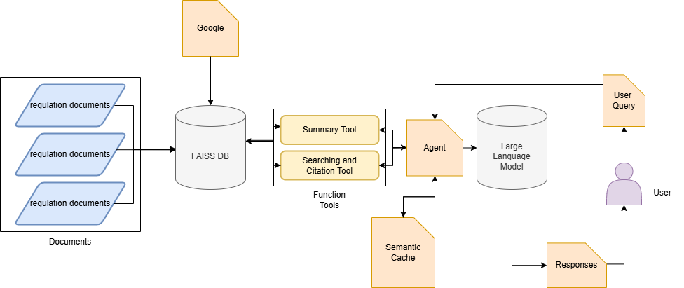

# Indonesia Import Law Chatbot

> 🚧 **Project Status**: This repository is currently under **active development and testing** (\~60% completed). The repository has not been fully updated, and some functionalities may change as improvements are made.

> 📌 **Purpose**: This system is built for academic research and portfolio development purposes. It serves as a prototype for exploring legal question answering, retrieval-augmented generation (RAG), and the evaluation of LLM performance in the context of Indonesian legal documents.

---

## 🧩 Task Definition

The chatbot performs **Attributed Question Answering** (AQA):

* Given a user query, it decomposes complex questions.
* It retrieves relevant legal passages via dense vector similarity (LaBSE + FAISS).
* It optionally returns cached answers using a semantic similarity threshold.
* The response is generated with attribution to the source document.

> **Format:**

```json
Input: {question}
Output: {answer, references}
```

> **Example:**

```json
Q: "Apa syarat izin impor untuk komoditas hortikultura?"
A: "Impor hortikultura hanya dapat dilakukan oleh importir terdaftar dan harus disertai rekomendasi dari Kementerian Pertanian."
Referensi: DOC001, DOC103
```

---

## 🧱 System Architecture

```



---

## 🗂️ Data

Raw input and structured legal documents:

* `datasets/cleaned_csv/`: Parsed CSV with `doc_id`, `bab`, `pasal`, `ayat`, `isi`, `penjelasan`
* `datasets/embeddings/`: FAISS vector index and metadata
* `datasets/semantic_cache/`: FAISS cache for queries

---

## ▶️ Usage

```bash
python src/agents/main_agent.py
```

* Input questions in Bahasa Indonesia
* System returns answer with document references
* Type `exit` to quit

To (re)generate the index:

```bash
python src/embedding/run_embedding.py
```

---

## 🔐 API Keys

* Place your keys in `groq_api.txt` or `openai_api.txt`
* Supported model: `deepseek-r1-distill-llama-70b`, `llama3-70b`, `gpt-4`

---

## 📚 Project Structure

```
datasets/
  ├ raw_texts/
  ├ cleaned_csv/
  ├ embeddings/
  └ semantic_cache/

src/
  ├ agents/
  │  └ main_agent.py
  ├ cache/
  │  └ semantic_cache.py
  ├ embedding/
  │  ├ embed_decomposed.py
  │  ├ retrieval_pipeline.py
  │  └ run_embedding.py
  └ tools/
     └ summarizer.py

models/
  └ llm_runtime.py

utils/
  └ prompt/
     ├ input_decomposition_prompt.py
     └ response_refinement_prompt.py
```

---

## 🔁 Semantic Cache Mechanism

* Uses FAISS to cache query embeddings and answers
* Uses cosine similarity threshold (`0.7`)
* Can be configured with TTL or periodic pruning
* Recommended to add `cache_manager.py` for scheduled cleaning

---

## 🧪 Research Objectives

This project serves as a testbed for legal RAG systems. Key research objectives include:

* Comparing dense retrievers (E5, LaBSE) vs. hybrid methods (SPLADE)
* Analyzing semantic cache efficiency (hit rate, precision, drift)
* Evaluating LLM generation quality using G-EVAL and ALCE
* Measuring hallucination rate and citation consistency in LLM outputs
* Benchmarking OpenAI vs. Groq models under legal QA tasks

---

## 🧾 Acknowledgements

* SentenceTransformers by HuggingFace
* FAISS by Facebook AI
* LaBSE by Google Research

---

© 2025. Developed for academic research and portfolio building in the legal AI domain.
